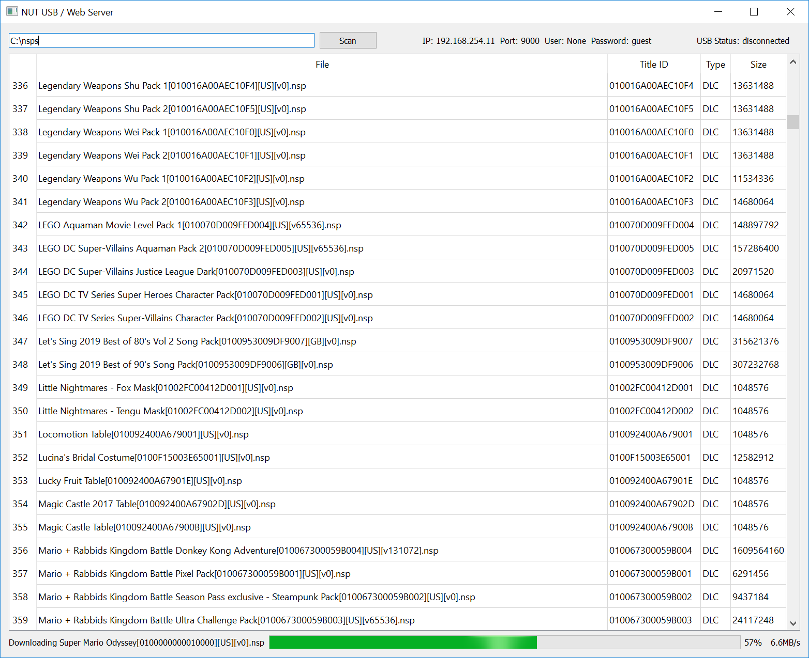

# NUT [](https://github.com/blawar/nut/actions?query=workflow%3ACI) [](https://coveralls.io/github/blawar/nut?branch=master) [](https://github.com/blawar/nut/blob/master/LICENSE) [](https://GitHub.com/blawar/nut/releases/)
This is a program that acts as a USB and network server for use with [Tinfoil](https://tinfoil.io/Download).

## Usage guide (Windows users)
* Download `tinfoil_driver.exe` and `nut.exe` from [here](https://github.com/blawar/nut/releases/latest).
* Install the drivers by running the `tinfoil_driver.exe` in the previous step.
* Run `nut.exe`. You should be presented with a GUI as shown in the picture above.

## Usage guide (UNIX users)
### Requirements
* Python 3.6+
* PIP modules from `requirements.txt`
* OpenSSL-backed curl (for pycurl)

### Installation guide
* Install Python 3.6+ from your preferred package manager, along with the `libusb`, `python3-pip` & `python3-pyqt5` packages.
* Install `curl` with the openssl backend. For Mac, follow [this](https://blog.birkhoff.me/switching-to-the-openssl-version-of-curl/), and set install options: `export PYCURL_SSL_LIBRARY=openssl`. For Linux, install `libssl-dev` (ie, `apt install libssl-dev libcurl4-openssl-dev`)
* Clone this repository to desired directory and change your working directory to the cloned repository.
* Install the PIP modules with the following command `pip3 install -r requirements.txt`. *If you previously tried installing pycurl and get the error `libcurl link-time ssl backend (openssl) is different from compile-time ssl backend (none/other)`, uninstall it, make sure to follow step 2 again (installing curl with the openssl backend), and `pip install pycurl --no-cache-dir`*
* (Linux only) Add the following code snippet to `/etc/udev/rules.d/99-switch.rules` using your favorite editor.
```
SUBSYSTEM=="usb", ATTRS{idVendor}=="16c0", ATTRS{idProduct}=="27e2", GROUP="plugdev"
```
* Run `python3 nut_gui.py` to launch the application.



## Application Summary
The GUI is divided into three distinct sections (header, body, footer).

### Application Header
The top section has a textbox to input a folder path to scan, along with a `Save` and `Scan` buttons to update path specified in the textbox and scan it. Next to it, you should see a `GDrive Auth` button. A detailed explaination of what it does can be found below. The IP/Port/User/Password are the information needed to login to the NUT server. To the right of those, you can also see a `USB Status` indicator, indicating whether a tinfoil client is connected via USB with the server.

### Application Body
This shows a table containing a list of NSW files that was detected by NUT from the scanned paths. It shows the title count, file name, title ID, title type and title size for each scanned file.

### Application Footer
This shows the progress information of any file that is currently being downloaded from the server.

### GDrive Auth
NUT will authenticate with GDrive if you create a GDrive application, and place its credentials.json file either in nut's root directory, or in the conf directory. You can generate / download credentials.json from https://developers.google.com/drive/api/v3/quickstart/python.

Once this is set up, you can access your gdrive through tinfoil, by using either the usbfs, nutfs, or GDrive protocol.

## License
This project is licensed under the terms of GPLv3, with the exemptions for specific projects noted below.

You can find a copy of the license in the [LICENSE file](./LICENSE).

Exemptions:
* [nsz](https://github.com/nicoboss/nsz) is exempt from the GPLv3 licensing and can license any source code from this project under MIT License instead. In doing so, they may alter, supplement, or entirely remove the copyright notice for each file they choose to relicense.
