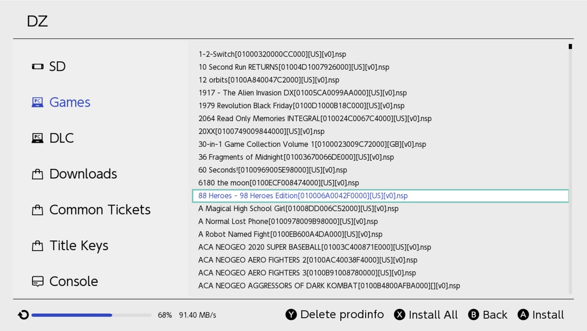
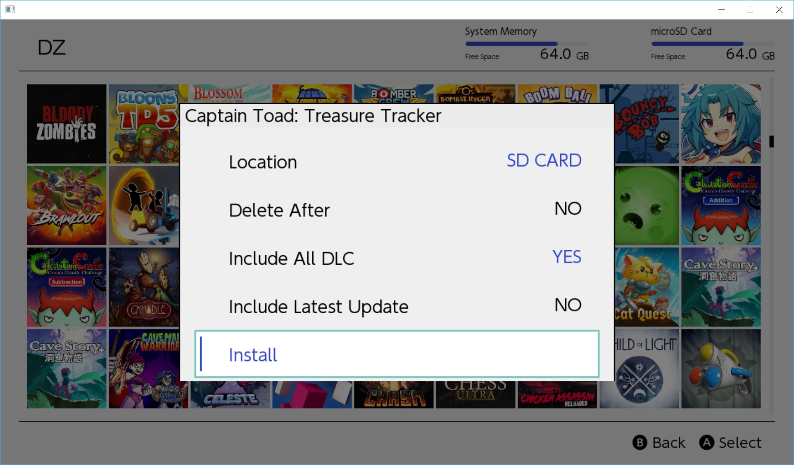

# DZ

A homebrew game, update, and DLC installer, and title key dumper.

## Screenshots

## Installation

 - Create the directory `/switch/dz/` on your switch's SD card.
 - Copy `dz.nro` to `/switch/dz/dz.nro`.
 - Obtain or generate a `keys.txt` file and place it in `/switch/dz/keys.txt`. `keys.txt` is a text file containing various Switch encryption keys. If you plan to generate it yourself, you can find instructions here:  https://gbatemp.net/threads/how-to-get-switch-keys-for-hactool-xci-decrypting.506978/ or use [`kezplez-nx`](https://github.com/shchmue/kezplez-nx)
 - Copy `locations.conf` to `/switch/dz/locations.conf`. You should edit this file, it is only an example. It points to the various local and network locations hosting your Switch content. You can view an example of how to add the various [supported protocols](#supported-protocols) by looking at the `locations.conf.example`s.

## Supported Protocols
Edit `locations.conf` to configure your install sources - you can mix and match.  Only ip's can be used the the URL's, no hostnames.
*Note that all directory paths must end in a forward slash.*

#### SD CARD
Supports installing from the local SD  card.  Use the URI `sdmc:/` to point to the SD card. Subdirectories also work, for example `sdmc://nsps/`.

#### FTP
Regular FTP, not FTPS, not SFTP, normal plain jane FTP.

#### HTTP
HTTP requires directory listing / browsing be enabled.

#### USB
Requires a configured `nut` server. See [here](https://github.com/blawar/nut/#usb-server-for-dz) for details.

#### NUT SERVER
Requires a configured `nut` server. See [here](https://github.com/blawar/nut/#server-gui) for details.  Always ensure you are running the latest NUT server with DZ.

## Trouble shooting

#### Only SD is listed in your locations in the application
Either your locations.conf is not located at /switch/dz/locations.conf, it is invalid JSON, or you saved the file as unicode.
- Ensure /switch/dz/locations.conf exists on your SD card.
- Ensure your locations.conf passes validation at https://jsonlint.com/ .
- Ensure you did not save your locations.conf file as unicode, the hidden BOM bytes will break parsing.

#### I see my network locations, however no files are listed
Either DZ cannot cannot connect with the network settings provided, you are using http and did not enable directory browsing, your firewall is blocking the connection.
- Ensure that you can connect to the FTP/HTTP/NUT server using the provided settings from a *different* PC than the one running the server.
- DZ does not support sub directories, so each directory must point to the exact directory the NSP's are located in.
- Ensure your firewall is allowing external connections.  Configure or disable your firewall.
- If using HTTP, ensure that directory listing / browsing is enabled.  This must be manually enabled with IIS.

#### I can see the files, but cannot download them.
- Ensure the url in your locations.conf ends with a forward slash.
- If using HTTP, verify that you can download the file using a web browser.  IIS requires you to add a MIME type for NSP (application/octet-stream) before you can download.

#### DZ Hangs at a black screen when I launch it
Ensure the network settings (specifcally the IP) are correct.

## Dumping Title Keys ##

Title keys are saved to `sdmc:/switch/dz/titlekeys.txt` when dumped. Additionally, you can place a single HTTP URL into `/switch/dz/titlekeys.url.txt` , to automatically submit your keys to that URL to back them up.

## Disclaimer

Use at your own risk, and [always have a NAND backup](https://gbatemp.net/threads/rcm-payload-hekate-ctcaer-mod.502604/).

## Additional Info

## FAQ

#### What does each icon on the left mean?
On the left, you will see icons that indicate what is not yet installed on your Switch, but is on your PC (the game controller), and everything that is on your PC/server (PC icon). Anything that is listed under Games, DLC, and Updates, with the game controller icon next to it, is what is currently on your PC but not on your Switch.
You can go to the Home tab to see everything that you have installed on your Switch.

# Changelog

- Added CURL error logging to console window for troubleshooting network issues.
- Added scroll bars to the menu, for those souls who add a million locations.
- Added colored background to finished queue entries.
- Fixed issue installing updates above 0x1000 / 65536
- Added scrollbars to console
- Removed Pepe icon.
- Fixed minor scrollbar graphical glitches.
- Fixed naming issues with apostrophes and ampersands.
- Added icons / tiled layout option and a switchable view for games.
- Added collapsible menu when browsing the panels.
- Fixed a few memory leaks
- Removed system version check for installs
- Fixed data corruption error when checking through the OS.
- Optimized UI icon performance some.
- Fixed out of memory issue while installing certain titles.
- Optimized opening of certain file types.
- Improved download speed a little.
- Added icons for DLC and updates.
- Fixed issue downloading small DLC.
- Added window for deleting application records.
- UI Tweaks
- Added sorting for network directories.
- Added file size and modified date for FTP locations.
- Added free space indicators.
- Moved progress bar to stop
- Added version and language to title list, and cleaned up the names
- Fixed early failed install bug from last commit, caused by slow SD cards.
- Fixed small DLC installs
- Added example location for SD installs
- Added NAND install option
- Added Nut server support
- Fixed some tile mode navigation wonkiness
- Increased write timeouts for people with slow SD cards.
- Moved installed applications to top.
- Added error message when the entire NCA is not downloaded.
- Fixed bug with some SD installs failing.
- Added free space refresh after installation.
- Added beginnings of sorting. Still buggy, do not report.
- Added light box for dialogs.
- Significantly improved icon loading.
- Fixed icon loading on applications home screen.
- Added install options. Only location and includeDlc are currently functional.
- Added USB experimental install. Server command (make sure nut can see your NSP's): `nut.py --usb`
- Added title type column, and region column now populates with NUT server.
- Added DLC info back into the name so you can differentiate them in the list.
- Added smoother tile scrolling.
- Added automatic merged lists of games, dlc, and updates, and hides titles you already have installed.  These sections merge all of the titles from all of your locations into one unique list.
- Merged updates section only shows updates higher than what you have installed.
- Added list of DLC and updates to the install dialog.
- Included Latest Update on the install dialog now works.
- Added support for loading titles.US.en.json to load names / metadata for all titles.  Place this file at /switch/dz/titles.US.en.json
- "Modified Date" is now "Release Date"
- Changed name to Tinfoil.
- Disbaled b-button exit.
- Fixed "Unknown" name display.
- Improved icon loading performance.
- Added small icon mode.
- Added smooth scrolling to regular lists.
- Fixed new graphical glitches.
- Added section name to title.
- Re-enabled dark theme
- Fixed b-button exit
- Fixed UI display bugs
- Enabled downloading thumbnails from web before trying to read from NSP.
- General UI enhancements.
- Improved internet network performance.
- Hostname's (should) work in locations now.
- Added read-only file browser.  Will add capabilities over time.
- Removed individual locations from menu.  NSP's can be installed from locations in the File Browser.

## Credits

Ideas from Adubbz:
https://github.com/Adubbz/

HACTOOL source code was reverse-engineered, with small bits of code lifted here and there:
https://github.com/SciresM/hactool

Random JSON parser:
https://github.com/nlohmann/json
